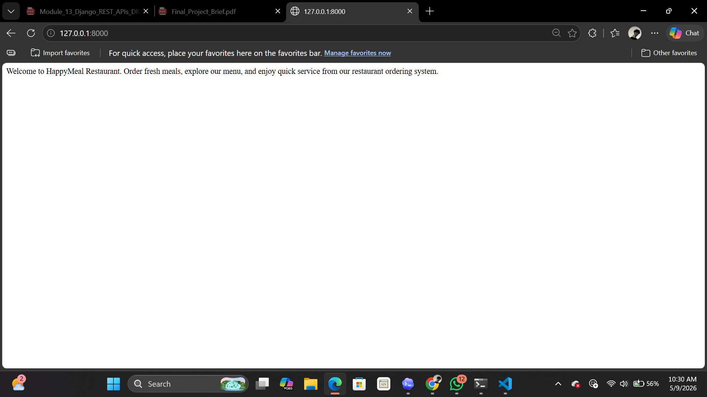
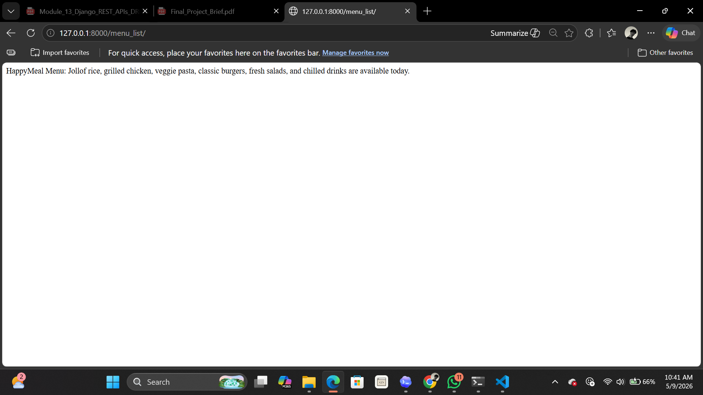

# Restaurant Ordering System

A simple Django project for a restaurant ordering system. The current work focuses on setting up basic restaurant pages using Django function-based views, URL routing, and plain `HttpResponse` responses.

## Project Overview

The project is named `happymeal` and currently contains two Django apps:

- `restaurants` - handles restaurant-facing pages such as home, menu, and about.
- `orders` - included in the project for future order-related features.

The current implementation adds three basic pages for the restaurant and wires them to clean URL paths.

## Completed Work

The following updates have been completed:

- Added a `home()` view for the homepage.
- Added a `menu_list()` view for the restaurant menu page.
- Added an `about()` view for information about the restaurant.
- Connected each view to a URL in the main project URL configuration.
- Registered the `restaurants` app correctly in `INSTALLED_APPS`.
- Added a custom 404 handler view as a bonus feature.
- Ran Django system checks successfully.
- Started the development server and confirmed the main pages work.

## Available Routes

| URL Path | View Function | Description |
| --- | --- | --- |
| `/` | `home()` | Displays a welcome message for HappyMeal Restaurant. |
| `/menu_list/` | `menu_list()` | Displays a short list of available menu items. |
| `/about/` | `about()` | Displays information about the restaurant. |
| `/admin/` | Django admin | Opens the default Django admin panel. |

## Custom 404 Page

A custom 404 handler has been added in `restaurants/views.py` and connected in `happymeal/urls.py`.

Note: Django only displays the custom 404 page when `DEBUG = False`. While `DEBUG = True`, Django shows its built-in debug 404 page instead.

## Important Files

```text
restaurant-ordering-system/
|-- happymeal/
|   |-- settings.py
|   `-- urls.py
|-- restaurants/
|   |-- apps.py
|   `-- views.py
|-- orders/
|-- manage.py
`-- README.md
```

## How To Run The Project

From the project folder, activate the virtual environment:

```powershell
.\venv\Scripts\activate
```

Run Django's system check:

```powershell
python manage.py check
```

Start the development server:

```powershell
python manage.py runserver
```

Open the app in a browser:

```text
http://127.0.0.1:8000/
http://127.0.0.1:8000/menu_list/
http://127.0.0.1:8000/about/
```

## Current Status

The project currently has a working homepage, menu page, about page, and custom 404 handler. The pages use simple `HttpResponse` output, so no templates are required for the current assignment.

Future improvements could include templates, models for menu items, order creation, styling, and database-backed restaurant data.


## SCREENSHOTS






## CONCLUSION
This project serves as a basic starting point for a restaurant ordering system using Django. The current implementation focuses on setting up the structure and routing for restaurant pages. Future work will expand on this foundation to create a more complete and functional application.